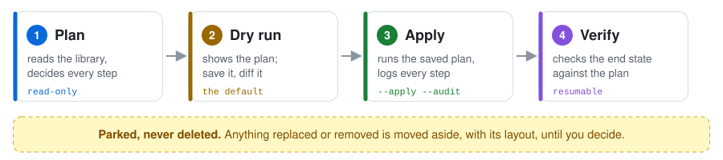
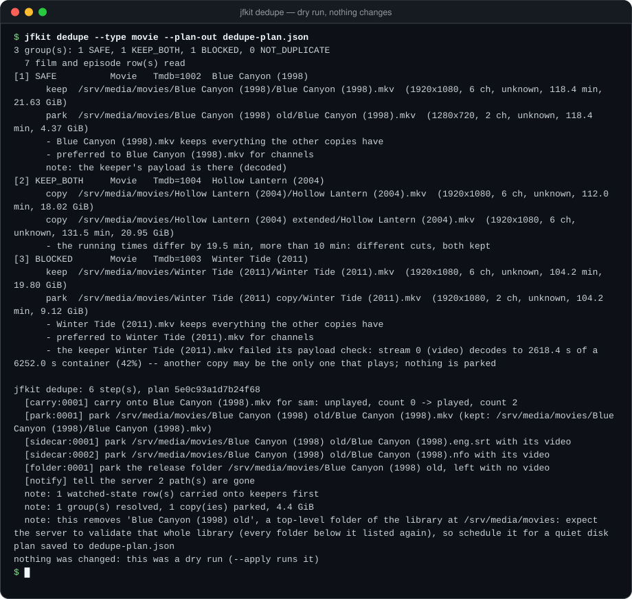

<div align="center">

<picture>
  <source media="(prefers-color-scheme: dark)" srcset="docs/assets/banner-dark.svg">
  <source media="(prefers-color-scheme: light)" srcset="docs/assets/banner-light.svg">
  
</picture>

<p>
  <a href="https://github.com/lukszi/media-toolkit/actions/workflows/ci.yml?query=branch%3Amaster"></a>
  <a href="LICENSE"></a>
  
  
  <a href="docs/gotchas/jellyfin-12.md"></a>
  <a href="https://github.com/astral-sh/ruff"></a>
  <a href="https://github.com/python/mypy"></a>
</p>

<p>
  <a href="#quick-start"><b>Quick start</b></a> ·
  <a href="#a-short-tour">Tour</a> ·
  <a href="#the-promise">The promise</a> ·
  <a href="#documentation">Docs</a> ·
  <a href="#contributing">Contributing</a>
</p>

</div>

## Why this exists

Anyone who runs a media server at home deserves a library that is **correct
and complete**: every film where it belongs, every episode under the right
number, every file actually playable, every audio track one somebody in the
house wants to hear.

And tidying it up should never cost a thing. Not a single track, not a file,
not the record of who has watched what. So every change these tools make is
**previewed** before it happens, **verified** after it happens, and
**reversible**: anything replaced or removed is moved aside, not deleted.

media-toolkit is three small command-line tools built around that promise.
They work on the video files themselves, and on a
[Jellyfin](https://jellyfin.org) server that shows them.

## What it helps with

Libraries that have grown for a while tend to collect the same handful of
problems. Here is what each one looks like, and what takes care of it.

| | The problem | What helps |
|---|---|---|
| 🔢 | **Wrong episode numbers.** A file named `Harbour Lights 1-05 Pilot.avi` shows up as episodes 1 *to* 5. A rename leaves the old title and artwork behind. | [`jfkit naming`](#predict-how-a-name-will-be-read) predicts how the server will read a name *before* you rename. [`jfkit rename`](#rename-without-losing-anything) renames videos and folders together with their subtitles, artwork and everyone's watched state. |
| 👯 | **The same film three times.** An old copy, a better copy, and one nobody remembers adding. | [`jfkit dedupe`](#resolve-duplicates) picks the copy that covers all the others, proves it plays, carries everyone's watched history onto it and parks the rest. |
| 🗣️ | **Audio in languages nobody speaks**, or tracks labelled with the wrong language. | `mkvkit langid` listens to the tracks and says what language they really are. `mkvkit remux` rebuilds a file without the ones your policy lets go, and `mkvkit verify` proves nothing else changed. |
| 📑 | **Missing or wrong chapters.** Chapter marks that are absent, or names that describe a different scene. | `mkvkit chapters` reads, checks and writes chapter marks, and refuses a list whose names don't hold up for your cut. |
| 💥 | **Files that are quietly broken.** A download that looks fine and stops halfway through. | [`mkvkit health`](#find-files-that-dont-play) sweeps a whole library, one reader per disk, and confirms only its suspects by reading them whole. |
| 🧹 | **Leftover clutter.** Sample clips, stray text files, release folders with no video left in them. | [`jfkit leftovers sweep`](#clear-out-the-clutter) proposes them by category and parks only the categories you release. `jfkit leftovers missing` reports gaps in seasons. |
| 🎧 | **The dub you love is on the wrong version.** A better picture in one release, the language you want in another, and they don't line up. | `dubalign` measures the offset across the whole running time, finds the jumps, splices and verifies the result against a 40 ms bar. |

## The promise

<picture>
  <source media="(prefers-color-scheme: dark)" srcset="docs/assets/flow-dark.svg">
  <source media="(prefers-color-scheme: light)" srcset="docs/assets/flow-light.svg">
  
</picture>

- **A dry run is the default.** Every command that changes a file or a
  server record only *shows* what it would do until you add `--apply`. A
  command with no dry run is not merged.
- **Parked, never deleted.** A replaced or removed file is moved to a
  parking folder, keeping its layout, and stays there until you decide.
  The verbs that overwrite a server record save what they replace first.
- **Verified before anything moves.** "The command exited 0" is not proof. A
  rebuilt file is compared with the original stream by stream, and a kept
  copy has to *play* before another copy is let go.
- **Watched history travels with the file.** Renames and duplicate
  resolution snapshot every user's watched state and carry it onto the file
  that stays.
- **One disk reader at a time.** Heavy reads queue per physical disk and wait
  while the disk is busy or somebody is watching, so a scan doesn't fight a
  film for the same disk.
- **Plans you can review and resume.** A dry run can be saved as a plan and
  applied later, exactly as reviewed. The plan-based verbs log every applied
  step, so an interrupted run picks up where it stopped.

<details>
<summary><b>The four principles in full</b></summary>

**Dry run first.** Every command that changes a file or a server record
defaults to a dry run and requires an explicit `--apply`. A command with no
dry-run path is not merged.

**Park, never delete.** Nothing is removed. A replaced original is *moved* to
the configured parked directory and left there; the caller decides, later and
by hand, whether it goes. `jfkit delete` parks too: it moves each released
file aside and then tells the server the path is gone, so the server's own
scan drops the row. It never asks the server to delete an item, because that
call removes the item's whole folder from disk.

**Verify both sides, inside the final container.** "The command exited 0" is
not verification. A rebuild is proved by collecting stream-level evidence from
the original and from the result -- track table, per-stream payload hashes,
chapters, container-level fields -- and comparing them against a declared
expected difference. Anything outside that difference is a failure. Cosmetic
differences are recorded with the reason they are cosmetic, never silently
allowed, and measurement happens in the rendered output, never in an
intermediate.

**Known-answer controls before trusting a measurement.** A measurement
pipeline is run against pairs whose answers are already known -- a track
against itself must read zero, a deliberately shifted pair must return the
shift it was given, the same pair measured at two starting points must agree,
and moving the *data* by a known amount must move the answer -- before any of
its numbers are believed. A measurement that has never been given a question
with a known answer is a number generator that has not yet been caught.

The reasoning behind all of it is
[`docs/methods/verification-discipline.md`](docs/methods/verification-discipline.md),
and every rule in that document names the function that implements it.

</details>

## What's inside

Three Python packages in one repository. Each installs a command of the same
name.

<table>
<tr>
<td width="33%" valign="top">

### 🎞️ `mkvkit`
**The file side.** Works on video files directly; no media server needed.

Look inside a file, check that it actually plays, scan a whole library for
broken files, fix track labels, drop unwanted audio tracks, check chapters,
identify spoken languages, copy files with both sides hashed, and swap a
rebuild into place.

[Guide](docs/mkvkit.md) · [Package](packages/mkvkit)

</td>
<td width="33%" valign="top">

### 🖥️ `jfkit`
**The server side.** Talks to Jellyfin 12.x over its web API.

Resolve duplicates, rename with watched state kept, sweep leftovers, report
what's missing, survey a whole collection, edit a record without emptying the
fields you didn't touch, and look after the server's database.

[Guide](docs/jfkit.md) · [Package](packages/jfkit)

</td>
<td width="33%" valign="top">

### 🎧 `dubalign`
**The dub side.** Puts an audio track from one release onto a different
release of the same film or episode.

Measure the offset along the whole timeline, find where it jumps, plan and
build the splice, and check every window of the result, not the average.

[Method](docs/methods/pal-alignment.md) · [Package](packages/dubalign)

</td>
</tr>
</table>

A few words that come up a lot:

- **Matroska** (`.mkv`) is the file format most home libraries use: one file
  that holds the picture, several audio tracks, subtitles and chapter marks.
- **Remux** means rebuilding such a file with a different set of tracks,
  without re-encoding anything.
- **Sidecars** are the small files that sit next to a video and belong to
  it: subtitles, artwork, `.nfo` descriptions, preview thumbnails.
- **Parking** is this project's word for moving a file aside instead of
  deleting it.

`mkvkit` and `dubalign` are useful with no media server at all.

> [!NOTE]
> This project is not affiliated with, endorsed by, or part of the Jellyfin
> project. Everything here was validated against Jellyfin 12.1.

## Quick start

You need **Python 3.11 or newer** and **git**. The verbs that read or write
video also need **ffmpeg** and the **MKVToolNix** command-line tools on your
`PATH`.

> [!IMPORTANT]
> These packages are **not on PyPI**. `pip install mkvkit` from PyPI does not
> install this project, and any package of that name there is not this one.
> Install from GitHub as shown here.

```sh
git clone https://github.com/lukszi/media-toolkit
cd media-toolkit
pip install -e packages/mkvkit -e packages/jfkit -e packages/dubalign
```

Now try a command that reads nothing but the names you give it: no server,
no configuration and no video files needed.

```console
$ jfkit naming "Northwind.S01E03.1080p.WEB-DL.x264-EXAMPLE.mkv" "Harbour Lights 1-05 Pilot.avi"
      S=1 E=3 end=- [season-episode]  Northwind.S01E03.1080p.WEB-DL.x264-EXAMPLE.mkv
RANGE S=- E=1 end=5 [absolute]  Harbour Lights 1-05 Pilot.avi
        note: read as an absolute episode number; adding an SxxEyy token to the name suppresses this expression
        note: this name produces an episode range; the end number is refilled from the path on any refresh that runs a provider, so only a rename clears it
        note: no season in the name or its folder: a file directly in the series folder is put in season 1

2 path(s), 2 shown, 1 would be read as a range, 0 claimed by no expression, 0 extra(s), 0 with a warning, 0 too long with their sidecars.
Checked against Jellyfin 12.1 (Emby.Naming at ee91c75e77), September 2026; see docs/gotchas/jellyfin-12.md.
```

The second name would show up as five episodes glued together. That is the
kind of mistake worth catching before a rename, not after.

<details>
<summary><b>Other ways to install</b>: one package at a time, optional extras, straight from GitHub</summary>

`jfkit` and `dubalign` depend on `mkvkit`. Name every package you need in
**one** `pip install` command, `mkvkit` included, so that pip takes `mkvkit`
from the checkout rather than looking for it on PyPI:

```sh
pip install -e packages/mkvkit                                # the file side alone
pip install -e packages/mkvkit -e packages/jfkit              # plus the server side
pip install -e "packages/mkvkit[langid]"                      # spoken-language identification
pip install -e packages/mkvkit -e "packages/dubalign[align]"  # changepoint detection and resampling
```

Or straight from GitHub without a checkout, again `mkvkit` in the same
command as anything that needs it (the trailing backslash continues one
command onto the next line in a POSIX shell):

```sh
pip install "mkvkit @ git+https://github.com/lukszi/media-toolkit#subdirectory=packages/mkvkit"
pip install "mkvkit[langid] @ git+https://github.com/lukszi/media-toolkit#subdirectory=packages/mkvkit"
pip install "mkvkit @ git+https://github.com/lukszi/media-toolkit#subdirectory=packages/mkvkit" \
            "jfkit @ git+https://github.com/lukszi/media-toolkit#subdirectory=packages/jfkit"
pip install "mkvkit @ git+https://github.com/lukszi/media-toolkit#subdirectory=packages/mkvkit" \
            "dubalign[align] @ git+https://github.com/lukszi/media-toolkit#subdirectory=packages/dubalign"
```

The external programs (ffmpeg, ffprobe, and the MKVToolNix command-line
tools) are discovered at run time and never vendored; speech-model weights
are never vendored either -- the model name and its cache directory are
configuration (`[langid].model`, `[langid].model_dir`).

</details>

## A short tour

Every example below is a dry run: it shows, and changes nothing. Add
`--apply` when the plan looks right. `--help` on any command lists every
option.

### Resolve duplicates

`jfkit dedupe` groups copies of the same film (by its database identifier)
or episode (by series, season and episode), reads every copy, and picks the
one that covers all the others. Before anything is planned, that keeper has
to prove it plays. If it doesn't, the group is blocked and nothing in it is
touched.



When the plan looks right, apply exactly that plan, with a log that lets a
stopped run resume:

```sh
jfkit dedupe --plan dedupe-plan.json --apply --audit dedupe-audit.jsonl
```

### Find files that don't play

```sh
mkvkit health /srv/media/movies /srv/media/series
```

A quick sampled check of every video file first, then a full read of only
the suspects, one reader per disk. It is read-only. Each file gets a verdict
(`OK`, `SUSPECT`, `CORRUPT`, `UNREADABLE`) with its evidence, and a re-run
reads only what changed.

### Rename without losing anything

```sh
jfkit rename "/srv/media/series/Harbour Lights/Harbour.Lights.S01E02.German.DL.mkv" \
             "/srv/media/series/Harbour Lights/Harbour.Lights.S01E02.mkv"
```

Predicts how the server will read the new name, carries the subtitles and
artwork along, snapshots every user's watched state, renames, waits for the
server to catch up, puts the watched state back and checks the end result.
`--map FILE` does many at once.

### Clear out the clutter

```sh
jfkit leftovers sweep                                # propose, by category
jfkit leftovers sweep --release sample --plan-out leftovers-plan.json
jfkit leftovers missing                              # what the library lacks
```

Nothing moves unless you name a category with `--release`, and even then it
is parked, not deleted.

### Predict how a name will be read

`jfkit naming PATH...` walks files or folders and exits non-zero if any name
would be read as an episode *range*. It ports the server's own naming rules
and is pinned by a table of invented names and the server's upstream naming
tests.

<details>
<summary><b>Everything else</b>: every verb of all three tools</summary>

| Tool | Verbs |
|---|---|
| `mkvkit` | `probe` · `integrity` · `health` · `chapters` · `tags` · `propedit` · `verify` · `remux` · `swap` · `copy` · `sidecars` · `walk` · `langid` · `steps` |
| `jfkit` | `naming` · `item` · `refresh` · `notify` · `survey` · `libopts` · `maintenance` · `swap` · `delete` · `segments` · `jobs` · `dedupe` · `find` · `children` · `playstate` · `userdata` · `rename` · `leftovers` |
| `dubalign` | `probe` · `decode` · `map` · `drift` · `changepoints` · `plan` · `splice` · `encode` · `verify` · `controls` |

[`docs/tour.md`](docs/tour.md) walks through all of them with the reasoning
each one carries. Two fully invented worked examples live in
[`examples/recipes/`](examples/recipes).

</details>

## Configuration

One TOML file holds every path, address and policy. Nothing is hardcoded,
and the file never holds a secret: it names *where* the access token comes
from.

```toml
[server]
url       = "http://127.0.0.1:8096"
token_env = "JFKIT_TOKEN"          # the token itself is never in this file
user_id   = "00000000-0000-0000-0000-000000000000"

[paths]
movies  = "/srv/media/movies"
staging = "/srv/staging"            # where rebuilds are assembled
parked  = "/srv/parked"             # where replaced originals go, and stay

[policy]
keep_languages = ["eng", "deu"]     # never dropped
default_audio  = "eng"
```

A fully annotated example, every value invented, is in
[`examples/mediatoolkit.example.toml`](examples/mediatoolkit.example.toml).

<details>
<summary><b>Where the file is found, and how secrets are handled</b></summary>

It is found in this order:

```
--config PATH  ->  $MEDIATOOLKIT_CONFIG  ->  ./mediatoolkit.toml  ->  per-user
```

The per-user location is the platform's own: the roaming application-data
directory on Windows, `$XDG_CONFIG_HOME` (or `~/.config`) elsewhere, under
`media-toolkit/config.toml`.

The `[tools]` table names the external programs, as a name on `PATH` or an
absolute path:

```toml
[tools]
ffmpeg   = "ffmpeg"
mkvmerge = "mkvmerge"
```

Secrets are never written into the file. It names an environment variable
(`token_env`) or a command that prints the secret (`token_command`, e.g. a
password-manager invocation). A literal `token = "..."` is refused at load
time, with an explanation rather than a stack trace. The loaded configuration
object is passed explicitly to everything that needs it: no module-level
singleton, nothing that hands a caller a token by being imported.

Validation reports *every* problem in one message, not the first one it hits.

</details>

## Documentation

| If you want to… | Read |
|---|---|
| use the file-side tools | [`docs/mkvkit.md`](docs/mkvkit.md) |
| use the server-side tools | [`docs/jfkit.md`](docs/jfkit.md) |
| see every verb and why it works the way it does | [`docs/tour.md`](docs/tour.md) |
| run a long cleanup safely, start to finish | [`docs/operating-playbook.md`](docs/operating-playbook.md) |
| follow a step-by-step procedure | [`docs/runbooks/`](docs/runbooks): [renaming](docs/runbooks/rename.md), [database upkeep](docs/runbooks/db-maintenance.md) |
| understand the method behind a verb | [`docs/methods/`](docs/methods): [verification](docs/methods/verification-discipline.md), [duplicates](docs/methods/duplicate-resolution.md), [safe deletion](docs/methods/safe-deletion.md), [swapping](docs/methods/swap-procedure.md), [languages](docs/methods/langid-ladder.md), [dub alignment](docs/methods/pal-alignment.md), [chapter names](docs/methods/chapter-names.md), [auditing a handoff](docs/methods/handoff-audit.md) |
| avoid a day lost to a known trap | [`docs/gotchas/`](docs/gotchas): [Jellyfin 12](docs/gotchas/jellyfin-12.md), [Matroska and ffmpeg](docs/gotchas/matroska-ffmpeg.md), [Windows shells](docs/gotchas/windows-shell.md) |
| reuse a building block | [`docs/patterns/`](docs/patterns): [detached jobs](docs/patterns/detached-jobs.md), [one reader per disk](docs/patterns/spindle-gate.md) |
| see a worked example | [`examples/recipes/`](examples/recipes) |

## Requirements

| | |
|---|---|
| **Python** | 3.11 or newer; CI tests 3.11, 3.12, 3.13 and 3.14 |
| **Operating systems** | Windows and Linux, both tested in CI |
| **Media server** | Jellyfin 12.x, for `jfkit` only; validated against 12.1 |
| **External programs** | ffmpeg and ffprobe, and the MKVToolNix command-line tools, for the verbs that read or write video |
| **Optional** | `mkvkit[langid]` for spoken-language identification, `dubalign[align]` for changepoint detection and resampling |

## FAQ

<details>
<summary><b>Can it delete my files?</b></summary>

No command here deletes a video. Files that are replaced or cleared out are
*parked*: moved to a folder you configure, keeping their layout, where they
stay until you remove them yourself.

</details>

<details>
<summary><b>Do I need Jellyfin?</b></summary>

Only for `jfkit`. `mkvkit` and `dubalign` work on plain files. A few `mkvkit`
options (such as `mkvkit health --titles`) use `jfkit` when it is installed
and a server is configured.

</details>

<details>
<summary><b>Where do the thresholds come from?</b></summary>

Several constants here were **fitted** against one collection: the
language-identification confidence bars, the agreement fractions, the
conditions on the trimmed aggregate, and the chapter window budgets. They ship
as documented defaults with the method used to fit them, so they can be
re-fitted on your own material --
[`docs/methods/langid-ladder.md`](docs/methods/langid-ladder.md) gives the
re-fitting procedure.

The alignment tolerance of 40 ms is a different kind of number, and it is
labelled as one: a **chosen** house bar of roughly one frame of picture, not a
value fitted against anything.
[`docs/methods/pal-alignment.md`](docs/methods/pal-alignment.md) says so where
it defines it.

Neither kind is a universal, and nothing in the documentation claims they
are. Nothing in the documentation describes the material they were fitted
on: no counts, sizes or timings of anybody's collection.

</details>

## Where it's heading

The project is published as it is built. The direction is set by the
promise above: every verb that writes gets a dry run, a plan you can review,
an audit log and a verified end state, and every fitted number ships with the
way to re-fit it. Each package is written so that it can move into a
repository of its own once it stands on its own; `CONTRIBUTING.md` has the
recipe.

Some things are deliberately not here. There is no chapter *namer*, only the
machinery that checks chapter names and refuses the ones that don't hold up.
Each package's `CHANGELOG.md` says what arrived when and what each version
leaves out on purpose.

## Contributing

Before opening an issue or a pull request, read
[`CONTRIBUTING.md`](CONTRIBUTING.md). It has the commit convention and the privacy rule every change is checked
against: every example title, path and identifier comes from the invented
cast in [`docs/CONVENTIONS.md`](docs/CONVENTIONS.md), and CI enforces it.

## Security

Please report a suspected vulnerability privately, as described in
[`SECURITY.md`](SECURITY.md), rather than in a public issue.

## Licence

[PolyForm Noncommercial License 1.0.0](LICENSE): free to use, change and
share for any noncommercial purpose. That is not the same thing as an
open-source licence.
